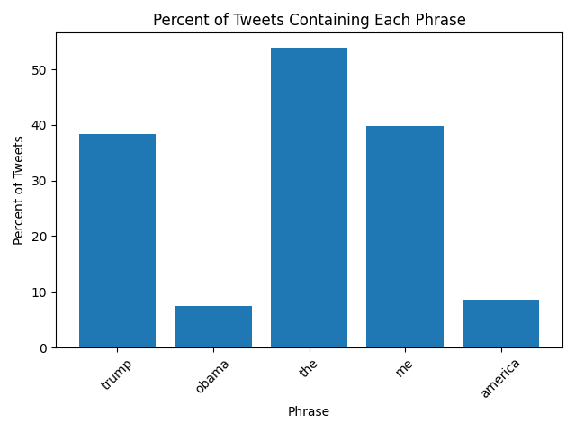
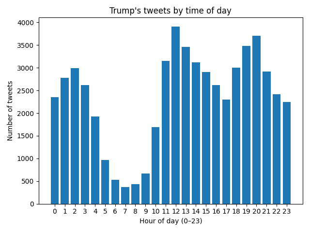

# www.trumptwitterarchive.com

## Word Frequency Analysis

| phrase            | percent of tweets |
| ----------------- | ----------------- |
|           america | 08.85             |
|                me | 41.88             |
|             obama | 05.51             |
|               the | 56.86             |
|             trump | 32.45             |

The table above shows the percentage of tweets containing these selected keywords across the full dataset of Trump's tweets, using the latest version of his data.

## Extra Credit: Tweets by Time of Day

This plot shows the number of Trump's tweets sent during each hour of the day (0–23).

